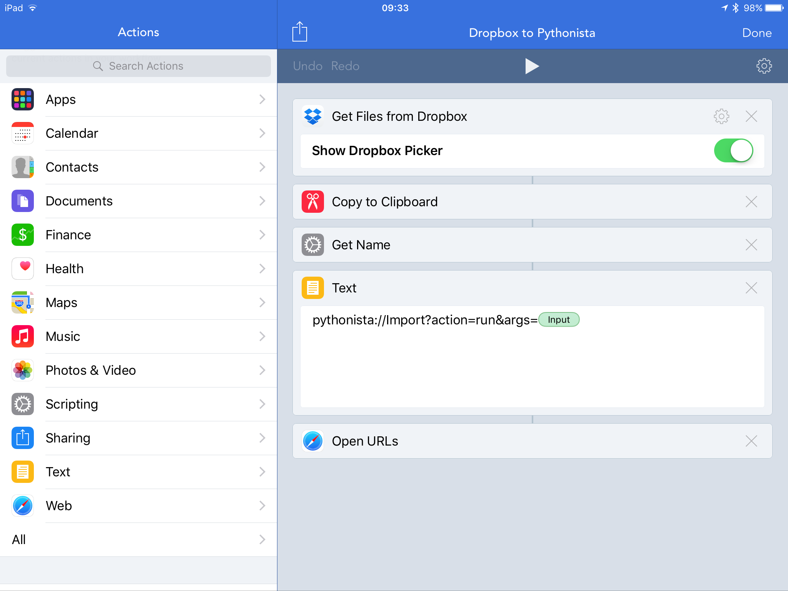
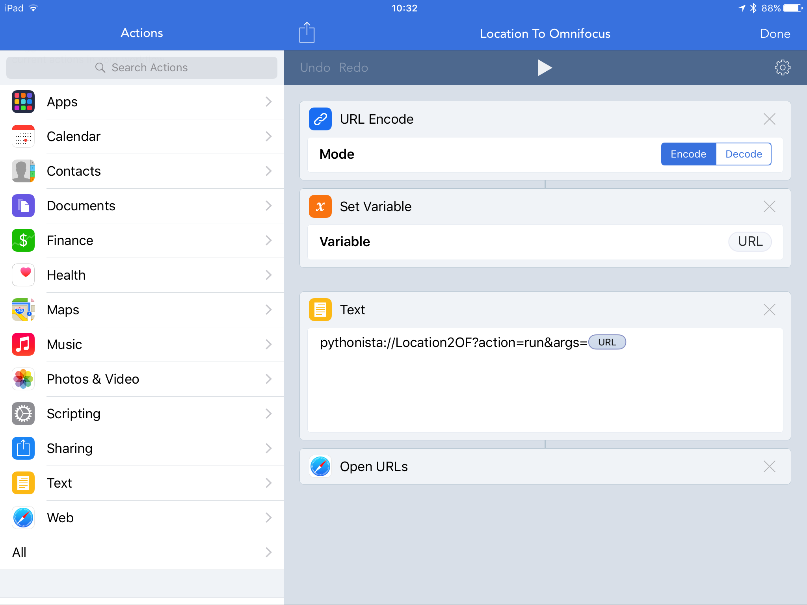
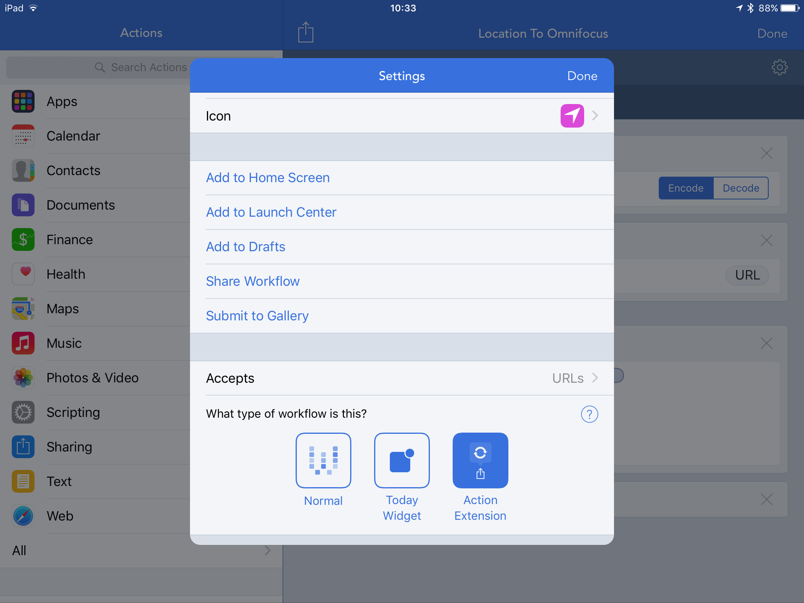

# Pythonista Utilities

Various iOS Pythonista Integrations I use.

Some of these need to be launched with the WorkFlow app (https://workflow.is) via Action Extensions,
so for example you can export a map pin to a WorkFlow extension and have it launch the correct
Pythonista script with the pin data as an argument. Pythonista then processes that and can launch
other apps in turn.

Useful links:

- [Pythonista](http://omz-software.com/pythonista/) - a full iOS Python dev environment.
- [WorkFlow](https://workflow.is) - an iOS automation utility.
- [Working Copy](http://workingcopyapp.com) - an iOS git/GitHub client.
- [Pythonista URL schemes](http://omz-software.com/pythonista/docs/ios/urlscheme.html).
- [WorkFlow URL Schemes](https://workflow.is/developer).

## WorkFlow for Importing python files from DropBox

## Workflow Action Extension for sending Apple Maps pins to Pythonista

